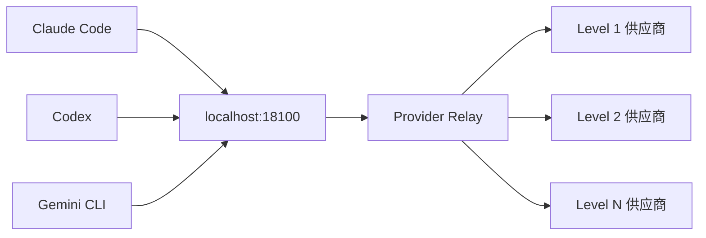

# Code Switch R

[](https://opensource.org/licenses/MIT)

🚀 **Code Switch R** 是一款专为 AI 开发者打造的桌面应用，集中管理 Claude Code、Codex 和 Gemini CLI 的供应商配置，实现智能故障转移和平滑切换体验。

## ✨ 核心特性

- **平滑切换供应商** - 无需重启 Claude Code/Codex/Gemini CLI，实时切换不同供应商
- **智能降级机制** - 支持多供应商分级优先级调度（Level 1-10），自动故障转移
- **模型白名单与映射** - 配置供应商支持的模型列表，自动转换模型名称
- **用量统计追踪** - 请求级别的 Token 用量统计和成本核算
- **MCP 服务器管理** - Claude Code 和 Codex 双平台 MCP Server 集中配置
- **CLI 配置编辑器** - 可视化编辑 CLI 配置，支持配置文件预览和智能粘贴
- **技能市场** - Claude Skill 自动下载与安装，内置热门技能仓库
- **Gemini CLI 管理** - 支持 Google OAuth、API Key、PackyCode 等多种认证方式
- **深度链接导入** - 通过 `ccswitch://` 协议一键导入供应商配置
- **速度测试** - 并发测试供应商端点延迟，优化选择
- **自定义提示词** - 管理 Claude/Codex/Gemini 的系统提示词
- **环境变量检测** - 自动检测并提示环境变量冲突
- **自动更新** - 内置更新检查，支持 SHA256 完整性校验
- **GLM Thinking** - Claude Code 使用官方渠道的GLM 4.6模型，强行开启思维模式

## 🔧 工作原理

应用启动时在本地 `:18100` 端口创建 HTTP 代理服务器，并自动配置 Claude Code 和 Codex 指向该代理。

### 代理架构



代理暴露两个关键端点：
- `/v1/messages` → 转发到 Claude 供应商
- `/responses` → 转发到 Codex 供应商

### 智能调度算法

请求由 `proxyHandler` 基于优先级分组动态选择 Provider：
1. 优先尝试 Level 1（最高优先级）的所有供应商
2. 失败后依次尝试 Level 2、Level 3 等
3. 同一 Level 内按用户排序依次尝试
4. 自动检查模型兼容性，跳过不支持的供应商

这让 CLI 看到的是固定的本地地址，而请求被透明路由到你配置的供应商列表。

## 🌟 特色功能

### 优先级分组调度

将供应商分为 1-10 个优先级级别：
- **Level 1**: 首选供应商（如官方 API）
- **Level 2-3**: 备选供应商（如第三方服务）
- **Level 4+**: 兜底供应商

同一级别内的供应商可通过拖拽调整顺序。

### 模型白名单与映射

针对不同供应商的模型命名差异，配置映射规则：

```json
{
  "supportedModels": {
    "anthropic/claude-*": true
  },
  "modelMapping": {
    "claude-*": "anthropic/claude-*"
  }
}
```

支持通配符匹配，自动转换请求中的模型名称。

### CLI 配置编辑器

可视化管理 Claude Code、Codex、Gemini 的 CLI 配置文件：

- **锁定字段**: 由代理托管，确保请求正确路由
- **可编辑字段**: 模型、思考模式、插件等用户配置
- **自定义字段**: 添加任意自定义配置项
- **配置预览**: 查看原始配置文件内容（Codex 同时显示 config.toml 和 auth.json）
- **智能粘贴**: 在空白区域粘贴 JSON/TOML/ENV 格式配置，自动识别并填充字段

## 🖼️ 界面预览

| 亮色主界面 | 暗色主界面 |
|---|---|
|  |  |

| 日志亮色 | 日志暗色 |
|---|---|
|  |  |

## 💻 开发指南

### 🔍 环境要求

| 依赖 | 版本要求 | 安装命令 |
|------|---------|----------|
| Go | 1.24+ | [官方下载](https://golang.org/dl/) |
| Node.js | 18+ | [官方下载](https://nodejs.org/) |
| Wails 3 CLI | latest | `go install github.com/wailsapp/wails/v3/cmd/wails3@latest` |

**Linux 额外依赖：**
```bash
# Ubuntu/Debian
sudo apt-get install build-essential pkg-config libgtk-3-dev libwebkit2gtk-4.1-dev

# Fedora
sudo dnf install gtk3-devel webkit2gtk4.1-devel

# Arch Linux
sudo pacman -S base-devel webkit2gtk-4.1
```

### 🚀 快速开始

```bash
# 克隆项目
git clone https://github.com/SimonUTD/code-switch-R.git
cd code-switch-R

# 安装前端依赖
cd frontend
npm install
cd ..

# 开发运行
wails3 task dev
```

### 📦 构建打包

#### 基础构建
```bash
# 更新构建元数据
wails3 task common:update:build-assets

# 打包当前平台
wails3 task package
```

#### Linux 平台打包
```bash
# 构建二进制
wails3 task linux:build

# 创建 AppImage
wails3 task linux:create:appimage

# 创建 DEB 包
wails3 task linux:create:deb

# 创建 RPM 包
wails3 task linux:create:rpm
```

#### 交叉编译
```bash
# Windows (macOS)
brew install mingw-w64
env ARCH=amd64 wails3 task windows:build
env ARCH=amd64 wails3 task windows:package

# Linux (macOS)
env ARCH=amd64 wails3 task linux:build
```

## 🚀 发布流程

推送 tag 即可触发 GitHub Actions 自动构建：

```bash
git tag v1.2.0
git push origin v1.2.0
```

自动构建产物：
- macOS: `codeswitch-macos-arm64.zip`, `codeswitch-macos-amd64.zip`
- Windows: `CodeSwitch-amd64-installer.exe`, `CodeSwitch.exe`, `updater.exe`
- Linux: `CodeSwitch.AppImage`, `codeswitch_*.deb`, `codeswitch-*.rpm`

## 🐧 支持的发行版

| 发行版 | 版本 | 支持格式 | 推荐格式 |
|--------|------|----------|----------|
| Ubuntu | 24.04 LTS | DEB / AppImage | DEB |
| Ubuntu | 22.04 LTS | AppImage | AppImage |
| Debian | 12 (Bookworm) | DEB / AppImage | DEB |
| Fedora | 39/40 | RPM / AppImage | RPM |
| Linux Mint | 22+ | DEB / AppImage | DEB |
| Arch Linux | Rolling | AppImage | AppImage |
| openSUSE | Leap/Tumbleweed | AppImage | AppImage |

> 💡 **提示**: Ubuntu 22.04 因 WebKit 版本限制（4.0），建议使用 AppImage。

## ❓ 常见问题

<details>
<summary>构建相关</summary>

- **macOS 无法打开 .app**: 先执行 `wails3 task common:update:build-assets` 再构建
- **macOS 交叉编译权限问题**: 终端需要完全磁盘访问权限
- **Linux AppImage FUSE 问题**: 使用 `--appimage-extract-and-run` 参数运行

</details>

<details>
<summary>运行时问题</summary>

- **代理连接失败**: 检查端口 18100 是否被占用
- **供应商配置不生效**: 确认 CLI 配置文件中的端点指向 localhost:18100
- **Gemini OAuth 失败**: 检查系统代理设置和网络连接

</details>

## 🛠️ 技术栈

| 组件 | 技术 | 版本 |
|------|------|------|
| **后端** | Go | 1.24+ |
| **Web框架** | Gin | latest |
| **数据库** | SQLite | 3.x |
| **前端** | Vue 3 | 3.x |
| **语言** | TypeScript | 5.x |
| **样式** | Tailwind CSS | 3.x |
| **桌面框架** | [Wails 3](https://v3.wails.io) | 3.x |
| **打包工具** | nFPM / appimagetool / NSIS | latest |

## 📄 License

本项目基于 [MIT License](LICENSE) 开源。

---

<div align="center">

**[⬆ 回到顶部](#code-switch-r)**

Made with ❤️ by [SimonUTD](https://github.com/SimonUTD)

</div>
